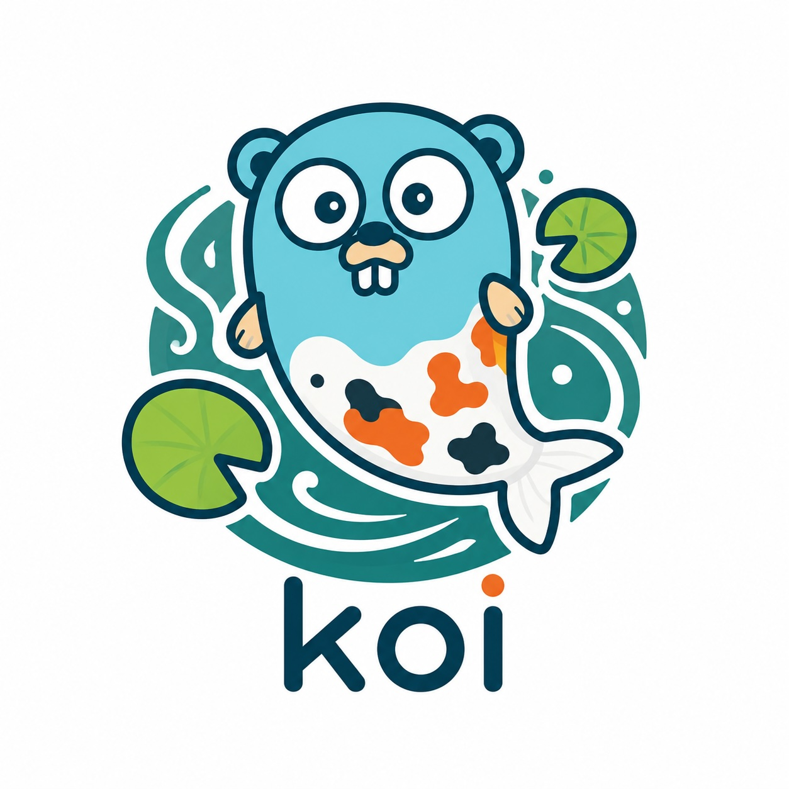

<p align="center">
    
</p>

<h6 align="center">Generic Goroutine and Worker Manager</h6>

<p align="center">
    <a href="https://pkg.go.dev/github.com/1995parham/koi?tab=doc" target="_blank">
        
    </a>
    
    
    
</p>

## Installation

You can add **Koi** into your project as follows:

```bash
go get github.com/1995parham/koi
```

## Usage

In Koi you first register a worker on a Pond then push your inputs.
Your worker has concurrency configuration for handling inputs.

The worker is generic: the first type parameter is the input type and the second is the output type.
Use `koi.NoReturn` as the output type for fire-and-forget workers that produce no result.

```go
package main

import (
 "log"
 "sync"
 "time"

 "github.com/1995parham/koi"
)

func main() {
 pond := koi.NewPond[int, koi.NoReturn]()

 var wg sync.WaitGroup

 printer := func(a int) koi.NoReturn {
  time.Sleep(1 * time.Second)
  log.Println(a)

  wg.Done()

  return koi.None
 }

 //nolint:mnd
 printWorker := koi.MustNewWorker(printer, 2, 10)

 pond.MustRegisterWorker("printer", printWorker)

 for i := range 10 {
  wg.Add(1)

  if _, err := pond.AddWork("printer", i); err != nil {
   log.Printf("error while adding job: %s\n", err)
  }
 }

 wg.Wait()

 // stop the workers and release their goroutines.
 pond.Close()

 log.Println("all jobs done")
}
```

**Note**: `pond.AddWork` is non-blocking unless the worker queue is full.

When a worker returns results, read them from `pond.ResultChan(id)`, or use
`pond.MapResults(id, fn)` — a Go 1.27 generic method that returns a channel of
the worker's results transformed by `fn`. Call `pond.Close()` to stop the
workers and release their goroutines when you are done.

## Terminology

- **Koi**: Koi is an informal name for the colored variants of C. rubrofuscus kept for ornamental purposes.
- **Pond**: an area of water smaller than a lake, often artificially made.
